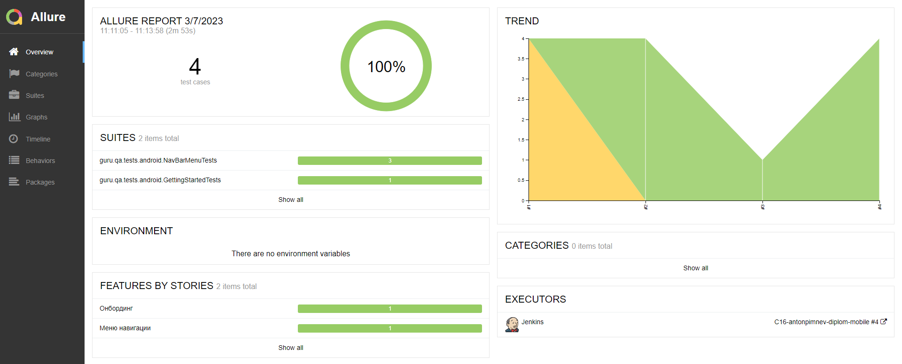
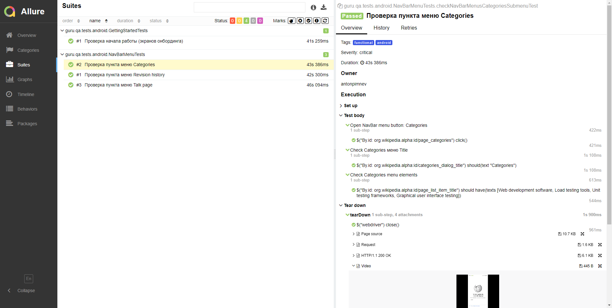
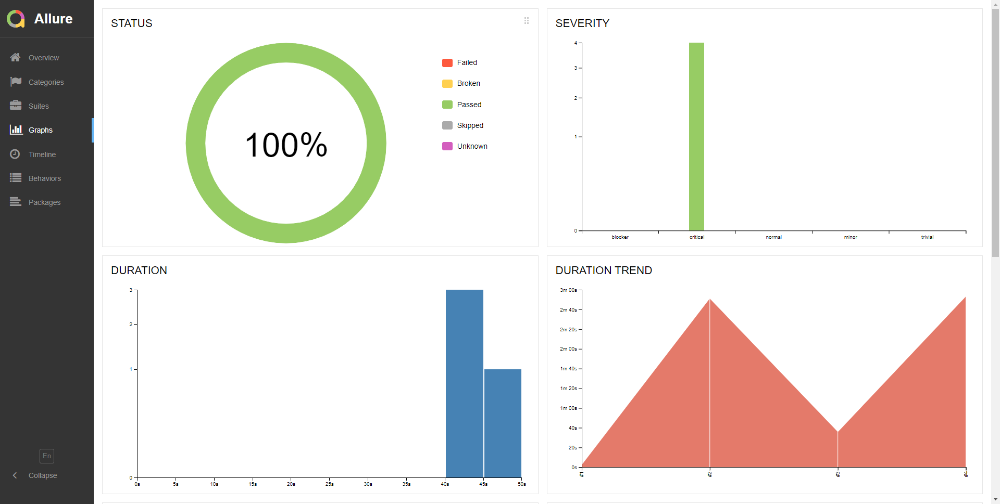
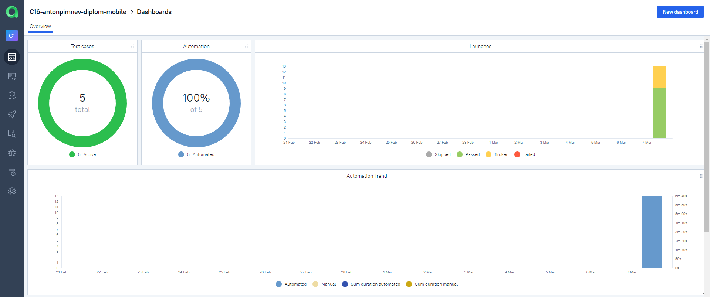
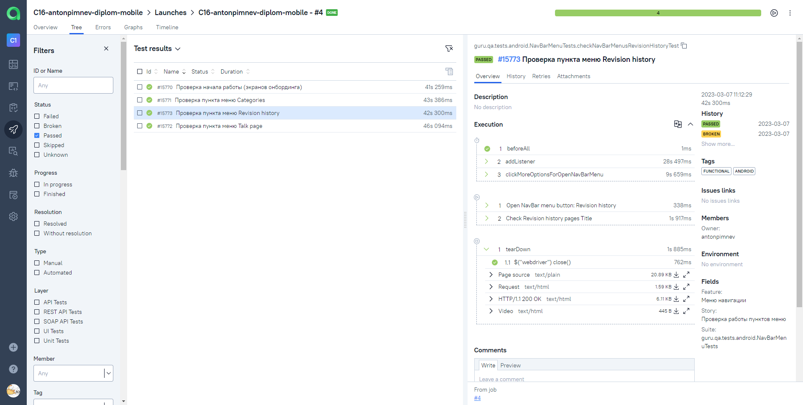
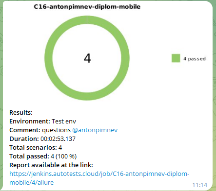
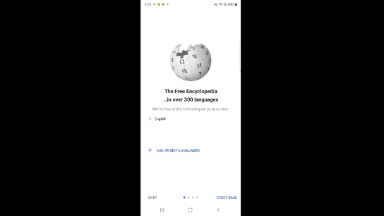
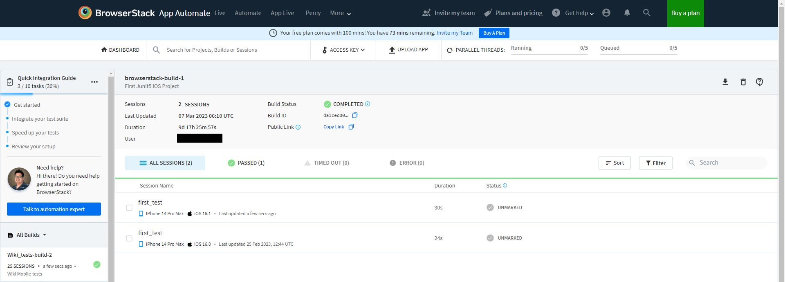

<a name="logo"></a>
## Учебный проект по автоматизации тестирования мобильного приложения Wikipedia (mobile)

<p align="center">

</p>

## Содержание:

- <a href="#tools">Технологии и инструменты</a>
- <a href="#cases">Список проверок, реализованных в тестах</a>
- <a href="#launch">Запуск тестов (сборка в Jenkins)</a>
- <a href="#allure">Allure-отчет</a>
- <a href="#allure-testops">Интеграция с Allure TestOps</a>
- <a href="#telegram">Уведомление в Telegram о результатах запуска тестов</a>
- <a href="#browserstack">Browserstack</a>

<a id="tools"></a>
## Технологии и инструменты

<p align="center">
<a href="https://www.jetbrains.com/idea/"></a>
<a href="https://www.java.com/"></a>
<a href="https://github.com/"></a>
<a href="https://junit.org/junit5/"></a>
<a href="https://gradle.org/"></a>
<a href="https://selenide.org/"></a>
<a href="https://developer.android.com/studio/"></a>
<a href="https://appium.io/"></a>
<a href="https://appium.io/"></a>
<a href="https://www.jenkins.io/"></a>
<a href="https://www.browserstack.com/"></a>
<a href="https://github.com/allure-framework/allure2"></a>
<a href="https://qameta.io/"></a>
</p>

<a id="cases"></a>
## Список проверок, реализованных в автотестах

- [x] Проверка отображения элементов экранов онбординга
- [x] Проверка работы пунктов навигационного меню
- [x] Проверка поиска по ключевому слову

<a id="launch"></a>
## Запуск тестов

###  Локальный запуск на эмуляторе:
1. Запуск из командной строки:
```bash
gradle clean android -DdeviceHost=mobile
```
2. Получение отчёта:
```bash
gradle allureServe
```

###  Настройка Jenkins и удаленный запуск в Browserstack:
1. Открыть <a target="_blank" href="https://jenkins.autotests.cloud/job/C16-antonpimnev-diplom-mobile/">проект</a>


2. Выбрать пункт **Собрать с параметрами**
3. Выбрать под какую мобильную операционную систему будут запущены тесты (Android/iOS)
4. Нажать **Собрать**
5. Результат запуска сборки можно посмотреть в отчёте Allure

<a id="allure"></a>
## </a> Отчет в <a target="_blank" href="https://jenkins.autotests.cloud/job/C16-antonpimnev-diplom-mobile/4/allure/">Allure report</a>

###  Главное окно
<p align="center">

</p>

###  Тесты
<p align="center">

</p>

###  Графики
<p align="center">

</p>

<a id="allure-testops"></a>
## </a> Интеграция с <a target="_blank" href="https://allure.autotests.cloud/project/1983/dashboards">Allure TestOps</a>

### Dashboard с результатами тестирования
<p align="center">

</p>

### Пример отчёта выполнения одного из автотестов
<p align="center">

</p>

<a id="telegram"></a>
## </a> Уведомление в Telegram о результатах запуска тестов

<p align="center">

</p>

<a id="browserstack"></a>
## </a> Пример видео прохождения теста в Browserstack
<p align="center">

</p>

### Dashboard с результатами тестирования
<p align="center">

</p>

[Вернуться к оглавлению ⬆](#logo)
